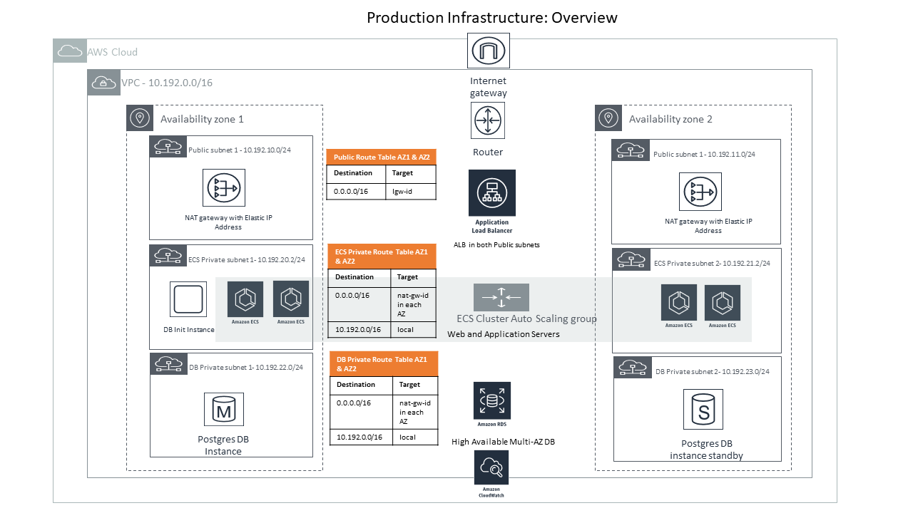

# Deploying the infrastructure for the Vibrato TechTestLab with Amazon ECS, AWS CloudFormation, Docker Containers, NAT, AWS RDS (postgres) and an Application Load Balancer over two Availability Zones


You can launch this CloudFormation stack in your account:

| AWS Region | Short name | | 
| -- | -- | -- |
| US East (Ohio) | us-east-2 | [](https://console.aws.amazon.com/cloudformation/home?region=us-east-2#/stacks/new?stackName=JTechTestApp&templateURL=https://s3.amazonaws.com/jnorback-open1/ecs-refarch-cloudformation/master.yaml) |
| US East (N. Virginia) | us-east-1 | [](https://console.aws.amazon.com/cloudformation/home?region=us-east-1#/stacks/new?stackName=JTechTestApp&templateURL=https://s3.amazonaws.com/jnorback-open1/ecs-refarch-cloudformation/master.yaml) |
| US West (N. California) | us-west-2 | [](https://console.aws.amazon.com/cloudformation/home?region=us-west-2#/stacks/new?stackName=JTechTestApp&templateURL=https://s3.amazonaws.com/jnorback-open1/ecs-refarch-cloudformation/master.yaml) |
| US West (Oregon) | us-west-1 | [](https://console.aws.amazon.com/cloudformation/home?region=us-west-1#/stacks/new?stackName=JTechTestApp&templateURL=https://s3.amazonaws.com/jnorback-open1/ecs-refarch-cloudformation/master.yaml) |
| Canada (Central) | ca-central-1 | [](https://console.aws.amazon.com/cloudformation/home?region=ca-central-1#/stacks/new?stackName=JTechTestApp&templateURL=https://s3.amazonaws.com/jnorback-open1/ecs-refarch-cloudformation/master.yaml) |
| EU (Paris) | eu-west-3 | [](https://console.aws.amazon.com/cloudformation/home?region=eu-west-3#/stacks/new?stackName=JTechTestApp&templateURL=https://s3.amazonaws.com/jnorback-open1/ecs-refarch-cloudformation/master.yaml) |
| EU (London) | eu-west-2 | [](https://console.aws.amazon.com/cloudformation/home?region=eu-west-2#/stacks/new?stackName=JTechTestApp&templateURL=https://s3.amazonaws.com/jnorback-open1/ecs-refarch-cloudformation/master.yaml) |
| EU (Ireland) | eu-west-1 | [](https://console.aws.amazon.com/cloudformation/home?region=eu-west-1#/stacks/new?stackName=JTechTestApp&templateURL=https://s3.amazonaws.com/jnorback-open1/ecs-refarch-cloudformation/master.yaml) |
| EU (Frankfurt) | eu-central-1 | [](https://console.aws.amazon.com/cloudformation/home?region=eu-central-1#/stacks/new?stackName=JTechTestApp&templateURL=https://s3.amazonaws.com/jnorback-open1/ecs-refarch-cloudformation/master.yaml) |
| Asia Pacific (Seoul) | ap-northeast-2 | [](https://console.aws.amazon.com/cloudformation/home?region=ap-northeast-2#/stacks/new?stackName=JTechTestApp&templateURL=https://s3.amazonaws.com/jnorback-open1/ecs-refarch-cloudformation/master.yaml) |
| Asia Pacific (Tokyo) | ap-northeast-1 | [](https://console.aws.amazon.com/cloudformation/home?region=ap-northeast-1#/stacks/new?stackName=JTechTestApp&templateURL=https://s3.amazonaws.com/jnorback-open1/ecs-refarch-cloudformation/master.yaml) |
| Asia Pacific (Sydney) | ap-southeast-2 | [](https://console.aws.amazon.com/cloudformation/home?region=ap-southeast-2#/stacks/new?stackName=JTechTestApp&templateURL=https://s3.amazonaws.com/jnorback-open1/ecs-refarch-cloudformation/master.yaml) |
| Asia Pacific (Singapore) | ap-southeast-1 | [](https://console.aws.amazon.com/cloudformation/home?region=ap-southeast-1#/stacks/new?stackName=JTechTestApp&templateURL=https://s3.amazonaws.com/jnorback-open1/ecs-refarch-cloudformation/master.yaml) |
| Asia Pacific (Mumbai) | ap-south-1 |  [](https://console.aws.amazon.com/cloudformation/home?region=ap-south-1#/stacks/new?stackName=JTechTestApp&templateURL=https://s3.amazonaws.com/jnorback-open1/ecs-refarch-cloudformation/master.yaml) |
| South America (São Paulo) | sa-east-1 |  [](https://console.aws.amazon.com/cloudformation/home?region=sa-east-1#/stacks/new?stackName=JTechTestApp&templateURL=https://s3.amazonaws.com/jnorback-open1/ecs-refarch-cloudformation/master.yaml) |

## Infrastructure: Overview



The span-up for the TechTestLAb infrastructure consists of a set of nested templates that deploy the following:

 - A tiered VPC with 2 public and 4 private subnets, spanning two Availability Zones in an AWS region.
 - A highly available ECS cluster deployed across two Availability Zones in an Auto Scaling group and that are AWS SSM enabled.
 - A pair of NAT gateways (one in each zone) to handle outbound traffic.
 - Two interconnecting microservices deployed as [ECS services](http://docs.aws.amazon.com/AmazonECS/latest/developerguide/ecs_services.html) (website-service and product-service). THIS NEEDS TO BE ADJUSTED.
 - An Application Load Balancer (ALB) in the public subnets to handle inbound traffic.
 - ALB path-based routes for each ECS service to route the inbound traffic to the correct service. THIS NEEDS TO BE ADJUSTED.
 - Centralized container logging with Amazon CloudWatch Logs.  THIS NEEDS TO BE ADJUSTED.
 - A [Lambda Function](https://docs.aws.amazon.com/lambda/latest/dg/welcome.html) and [Auto Scaling Lifecycle Hook](https://docs.aws.amazon.com/autoscaling/ec2/userguide/lifecycle-hooks.html) to [drain Tasks from your Container Instances](https://docs.aws.amazon.com/AmazonECS/latest/developerguide/container-instance-draining.html) when an Instance is selected for Termination in your Auto Scaling Group.  THIS NEEDS TO BE ADJUSTED.
 - A Highly Available AWS RDS (Postgres) DB spanning 2 Availability Zones (active + hot standby).

#### Infrastructure: Communication Traffic Flow


#### Infrastructure: Security Groups


## Template details

The templates below are included in this repository and reference architecture:

| Template | Description |
| --- | --- | 
| [master.yaml](master.yaml) | This is the master template - deploy it to CloudFormation and it includes all of the others automatically. |
| [infrastructure/vpc.yaml](infrastructure/vpc.yaml) | This template deploys a VPC with a pair of public two private subnets (ECS cluster) and two additional private subnets for the Database pread across two Availability Zones. It deploys an Internet gateway,with a default route on the public subnets. It deploys a pair of NAT gateways (one in each zone), and default routes for them in the private subnets. THIS NEEDS TO BE ADJUSTED.|
| [infrastructure/security-groups.yaml](infrastructure/security-groups.yaml) | This template contains the security groups required by the entire stack. They are created in a separate nested template, so that they can be referenced by all of the other nested templates. |
| [infrastructure/load-balancers.yaml](infrastructure/load-balancers.yaml) | This template deploys an ALB to the public subnets, which exposes the various ECS services. It is created in in a separate nested template, so that it can be referenced by all of the other nested templates and so that the various ECS services can register with it. THIS NEEDS TO BE ADJUSTED. |
| [infrastructure/ecs-cluster.yaml](infrastructure/ecs-cluster.yaml) | This template deploys an ECS cluster to the private subnets using an Auto Scaling group and installs the AWS SSM agent with related policy requirements. |
| [infrastructure/lifecyclehook.yaml](infrastructure/lifecyclehook.yaml) | This template deploys a Lambda Function and Auto Scaling Lifecycle Hook to drain Tasks from your Container Instances when an Instance is selected for Termination in your Auto Scaling Group.
| [services/product-service/service.yaml](services/product-service/service.yaml) | This is an example of a long-running ECS service that serves a JSON API of products. For the full source for the service, see [services/product-service/src](services/product-service/src). THIS NEEDS TO BE ADJUSTED.|
| [services/website-service/service.yaml](services/website-service/service.yaml) | This is an example of a long-running ECS service that needs to connect to another service (product-service) via the load-balanced URL. We use an environment variable to pass the product-service URL to the containers. For the full source for this service, see [services/website-service/src](services/website-service/src). THIS NEEDS TO BE ADJUSTED.|

After the CloudFormation templates have been deployed, the [stack outputs](http://docs.aws.amazon.com/AWSCloudFormation/latest/UserGuide/outputs-section-structure.html) contain a link to the load-balanced URLs for each of the deployed microservices THIS NEEDS TO BE ADJUSTED..


The ECS instances should also appear in the Managed Instances section of the EC2 console.

## How do I...?


### Change the VPC or subnet IP ranges

You can adjust the CIDR ranges used in this section of the [master.yaml](master.yaml) template:

```
VPC:
  Type: AWS::CloudFormation::Stack
    Properties:
      TemplateURL: !Sub ${TemplateLocation}/infrastructure/vpc.yaml
      Parameters:
        EnvironmentName:    !Ref AWS::StackName
        VpcCIDR:            10.192.0.0/16
```

